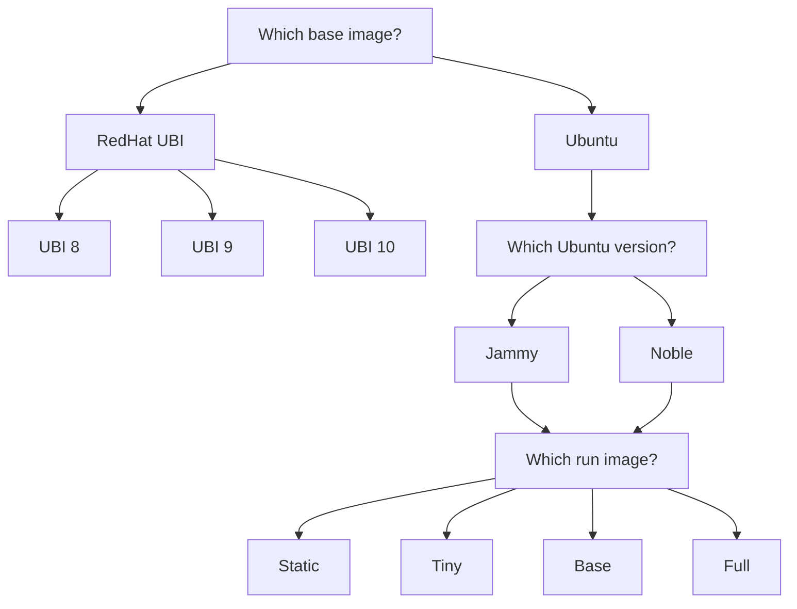

# Mermaid Diagrams

## Which Builder Decision Tree

```mermaid
graph TD
    A[Which base image?] --> B[Ubuntu]
    A --> C[RedHat UBI]
    
    C --> D[UBI 8]
    C --> E[UBI 9]
    C --> F[UBI 10]
    
    B --> G[Which Ubuntu version?]
    G --> H[Jammy]
    G --> I[Noble]
    
    H --> J[Which run image?]
    I --> J[Which run image?]
    
    J --> L[Static]
    J --> M[Tiny]
    J --> N[Base]
    J --> O[Full]
```